# GUARDIA  
**Geo-fenced Unified Alert & Response for Dynamic Incident Assistance**

A smart tourism safety ecosystem designed to make travel in North-Eastern region of India **safe, structured, and stress-free**.

---

## Overview

Tourism in the North-East offers immense natural and cultural value, but tourists often face three critical challenges:
- Unstructured trip planning
- Delayed or unreliable emergency response
- Poor network connectivity in remote and hilly areas

**GUARDIA** addresses these challenges through an integrated system that combines a mobile application, an authority monitoring backend, AI-driven safety scoring, and an offline-capable mesh network.  

This project was developed as part of **Smart India Hackathon (SIH)**, aligned with problem statements from the **Ministry of Development of North Eastern Region (DoNER)**.

---

## Key Features

### Tourist Mobile Application
- Trip itinerary planning with destination selection and guidelines
- KYC-based digital identity using Aadhaar / passport / valid ID
- Unique QR code for seamless checkpoint verification
- Real-time maps, safety alerts, and location-based updates
- Multilingual support for domestic and international tourists

### Three-View System
- **User View** – itinerary, safety score, alerts, navigation
- **Friends / Family View** – live location tracking and SOS notifications
- **Authority View** – QR verification, tourist monitoring, SOS handling

### Emergency Handling
- **Heavy Emergency (SOS):**
  - Direct geo-tagged alerts to authorities
  - Simultaneous notification to trusted contacts
- **Light Emergency:**
  - Navigation assistance
  - Area danger alerts and local news
  - Context-aware safety guidance

### AI-Based Safety Scoring
- Predictive safety score for locations
- Based on GPS activity density, historical data, and reviews
- Helps tourists make informed travel decisions

### Authority Dashboard

The Authority Dashboard is a dedicated web-based interface designed for government officials and authorized personnel to monitor, verify, and respond to tourist activity in real time.
Built using **React (Vite)**, the dashboard connects securely to the central backend and serves as the operational control layer of the system.

**Core Responsibilities:**
- Secure login and role-based access for authorities
- KYC verification and approval workflow
- QR code scanning and instant tourist identity validation
- Real-time visualization of tourist locations on an interactive map
- Monitoring and handling of SOS alerts with priority routing
- Tourist density overview to identify high-risk or overcrowded areas

The dashboard enables authorities to respond quickly to emergencies, reduce manual verification overhead, and maintain situational awareness across regions. By centralizing tourist data, SOS alerts, and safety insights, it ensures faster decision-making and improved coordination during critical events.

### Low Connectivity Support
- Hardware-assisted mesh / peer-to-peer network
- Offline SOS triggering and relay
- Cached itineraries and offline maps
- Designed for remote, low-signal regions

---
### System Architecture

```mermaid
graph TD
    %% 1. Tourist App Node
    App["📱 <b>Tourist App</b> <br/>(React Native – iOS/Android)<hr/>- Login / Signup<br/>- KYC Verification<br/>- QR Code Identity<br/>- Trip Planning<br/>- SOS Button<br/>- Multilingual UI"]
    
    %% 2. Backend Node
    Backend["⚙️ <b>Backend Server</b> <br/>(Node.js)<hr/>- Auth & KYC Validation<br/>- QR Code Generation<br/>- Trip & Destination Data<br/>- Emergency Routing<br/>- Safety Score Engine"]
    
    %% 3. Data & AI Nodes
    Data[("🗄️ <b>Data Sources</b><br/><hr/>- destinations.csv<br/>- reviews.csv")]
    AI["🧠 <b>AI / Safety Engine</b><br/><hr/>- GPS-based Analysis<br/>- Incident Density<br/>- Risk Scoring Model"]

    %% 4. Authority & Emergency
    AuthDash["🖥️ <b>Authority Dashboard</b><br/><hr/>- QR Scan & Verification<br/>- SOS Monitoring<br/>- Tourist Density View<br/>- Incident Management"]
    Emergency["🚑 <b>Emergency Response</b><br/>(Police / Medical / Admin)"]

    %% 5. Mesh Network
    Mesh["📡 <b>Low Connectivity / Mesh</b><br/>(Peer-to-Peer / LoRa)<hr/>- Offline SOS Trigger<br/>- Cached Itineraries<br/>- Offline Maps<br/><i>*Hops until connectivity found*</i>"]

    %% CONNECTIONS
    App <==>|HTTPS / REST API| Backend
    Backend <--> Data
    Backend <--> AI
    Backend --> AuthDash
    AuthDash --> Emergency
    Mesh -.->|Offline SOS Signal| AuthDash

    %% STYLING 
    classDef alert fill:#ffcccc,stroke:#000000,stroke-width:2px,color:#000000;
    class Emergency alert;
```

---

## Repository Structure

This project is organized as a multi-repo system:

- **Mobile Application Repository:**  
  [https://github.com/TrueCoderSja/SafeLink-client]

- **Backend & API Repository:**  
  [https://github.com/777mudit/SafeLink-backend]

- **Authority Dashboard Repository:**  
  [https://github.com/VS2412/Auth-Dash]

- **AI / Safety Scoring Module Repository:**  
  [https://github.com/VS2412/Enpitsu]

- **Hardware & Mesh Connectivity:**  
  [https://github.com/VS2412/Hackaccino_Proj]
  
---

## Scope & Notes

- The system is designed to be scalable across all North-Eastern states
- Focus is on real-world constraints such as connectivity, safety, and authority coordination

---

## Why This Project Matters

GUARDIA is not just a travel app.  
It is a **safety-first tourism infrastructure** that builds trust between tourists, families, and authorities while enabling faster emergency response and better planning in underserved regions.

---

## Team

Built by the team as part of Smart India Hackathon (SIH), with a focus on real-world applicability, system design, and scalability.

## License
This project is licensed under the MIT License.
